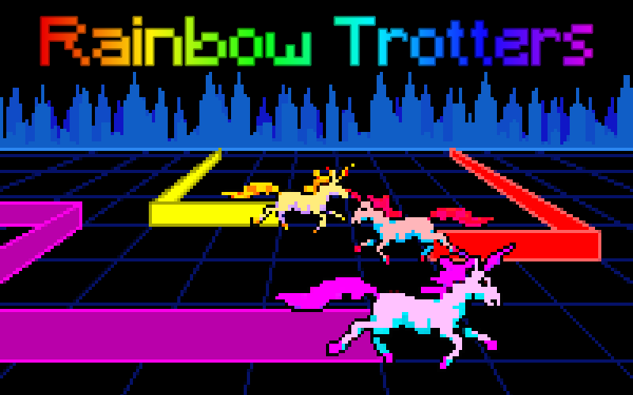

<h1 align="center">Rainbow Trotters</h1>

Compete against Bots or against other players in this top-down lightcycle-inspired game, except you're a unicorn!

Don't hit the trails the unicorns leave behind (including your own!).

Pick up powers to get an edge against your opponents:
* Ghost - Pass through obstacles and trails (but you stop leaving a trail of your own)
* Wall Break - Break through trails
* Speed - Gallop faster!

## Controls

**Keyboard**
* Movement: `W` `A` `S` `D` or `←` `↑` `→` `↓`
* Powers: `Space`

**Mobile**
* Tap the sides of the screen to make the unicorn turn left or right
* Tap the bottom of the screen to use your power

# Play
Play the live version: https://js13kgames.com/games/rainbow-trotters

This is a game developed for [js13kgames 2026 competition](https://2026.js13kgames.com/) where the theme is "**Unicorns and Rainbows**".